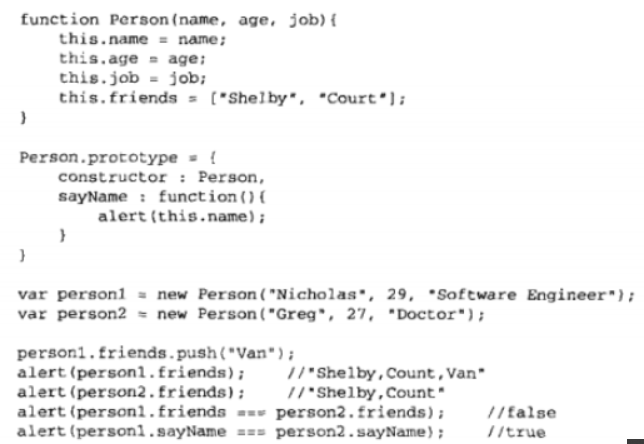

# pureComponent和memo组件

> 一个 React 组件，它包含两个子组件，分别是函数组件和 Class 组件。当这个 React 组件的 state 发生变化时，两个子组件的 props 并没有发生变化，此时是否会导致函数子组件和 Class 子组件发生重复渲染呢？

https://zhuanlan.zhihu.com/p/95865701

**App 组件：**

```
import React, { Component, Fragment } from 'react';
import ReactDOM from 'react-dom';
import ChildClass from './ChildClass.jsx';
import ChildFunc from './ChildFunc.jsx';

class App extends Component {
  state = {
    cnt: 1
  };

  componentDidMount() {
    setInterval(() => this.setState({ cnt: this.state.cnt + 1 }), 2000);
  }

  render() {
    return (
      <Fragment>
        <h2>疑问：</h2>
        <p>
          一个 React 组件，它包含两个子组件，分别是函数组件和 Class 组件。当这个 React 组件的 state
          发生变化时，两个子组件的 props 并没有发生变化，此时是否会导致函数子组件和 Class 子组件发生重复渲染呢？
        </p>
        <div>
          <h3>验证(性能优化前)：</h3>
          <ChildFunc />
          <ChildClass />
        </div>
      </Fragment>
    );
  }
}

ReactDOM.render(<App />, document.getElementById('root'));
```

**Class 组件：**

```
import React, { Component } from 'react';

let cnt = 0;

class ChildClass extends Component {
  render() {
    cnt = cnt + 1;

    return <p>Class组件发生渲染次数: {cnt}</p>;
  }
}

export default ChildClass;
复制代码
```

**函数组件：**

```
import React from 'react';

let cnt = 0;

const ChildFunc = () => {
  cnt = cnt + 1;

  return <p>函数组件发生渲染次数: {cnt}</p>;
};

export default ChildFunc;
```

实际验证结果表明，如下图所示，无论是函数组件还是 Class 组件，只要父组件的 state 发生了变化，二者均会产生重复渲染。 而且由于传入的值props是没变化的，只是重复渲染而并没有影响值

[](https://camo.githubusercontent.com/9d5e01a422a5477a1fffa58960e7147706a4dcfd0144e5f3f8b25a113e118522/68747470733a2f2f757365722d676f6c642d63646e2e786974752e696f2f323031392f31322f312f313665633034303864633833663062343f696d616765736c696d)

### PureComponent

`React.PureComponent` 与 `React.Component` 很相似。两者的区别在于 `React.Component` 并未实现 `shouldComponentUpdate()`，而 `React.PureComponent` 中以浅层对比 prop 和 state 的方式来实现了该函数。

如果赋予 React 组件相同的 props 和 state，render() 函数会渲染相同的内容，那么在某些情况下使用 React.PureComponent 可提高性能。

#### pureComponent的局限性

如果对象中包含复杂的数据结构，则有可能因为无法检查深层的差别，产生错误的比对结果。仅在你的 props 和 state 较为简单时，才使用 React.PureComponent，或者在深层数据结构发生变化时调用 **forceUpdate**() 来确保组件被正确地更新。你也可以考虑使用 **immutable** 对象加速嵌套数据的比较

**immutable**是可变对象

不理解的地方

> 1.React.PureComponent 中的 shouldComponentUpdate() 将跳过所有**子组件树**的 prop 更新。因此，请确保所有子组件也都是“纯”的组件（什么是纯的组件）
>
> 2.immutable是可变对象  但immutable是啥子玩意儿啊  业务遇到再说
>
> 3.

#### PureComponent组件定义

我们先看下在 React 中 PureComponent组件是如何定义的，以下代码摘自 React v16.9.0 中的 `ReactBaseClasses.js`文件。

```react
//

// ComponentDummy起桥接作用，用于PureComponent实现一个正确的原型链，其原型指向Component.prototype
//什么是dummy  dummy可以称之为没有任何功能的函数 类似花瓶
//实际上也就类似于空函数
//component
function ComponentDummy() {}
ComponentDummy.prototype = Component.prototype;

// 定义PureComponent构造函数
function PureComponent(props, context, updater) {
  this.props = props;
  this.context = context;
  // If a component has string refs, we will assign a different object later.
  /**
  *1.refs提供一种允许我们访问Dom节点或者render方法中创建的react元素
  *2.Ref 转发是一个可选特性，其允许某些组件接收 ref，并将其向下传递（换句话说，“转发”它）给子组件。
  *3.ref转发是一种可选特性，其允许某些组件接受ref，并向下传递给子组件
  *4.在React单向数据流中，props是父子组件交互的唯一方式。要修改一个子组件，需要通过新的props来重新渲染。在有些情况下，需要在数据流之外强行修改子组件(组件或者Dom元素),那么可以通过Refs来进行修改子组件。 （不懂：refs是怎么改的
  **/
  this.refs = emptyObject;
  this.updater = updater || ReactNoopUpdateQueue;
}

// 将PureComponent的原型指向一个新的对象，该对象的原型正好指向Component.prototype
const pureComponentPrototype = (PureComponent.prototype = new ComponentDummy());

// 将PureComponent原型的构造函数修复为PureComponent
pureComponentPrototype.constructor = PureComponent;

// Avoid an extra prototype jump for these methods.
Object.assign(pureComponentPrototype, Component.prototype);

// 创建标识isPureReactComponent，用于标记是否是PureComponent
pureComponentPrototype.isPureReactComponent = true;
```

> 
>
> **注意**：
>
> 上面的这个  应该是原型模式  对比下面的内容看一下

#### 原型模式

> 原型模式其实是想结合工厂模式和构造模式的优点


1. 工厂模式：函数creatPerson根据接受的参数来构建一个包含所有必要信息的person对象，这个函数可以被无数次的调用，工厂模式尽管解决了创建多个相似对象的问题，却没有解决对象识别的问题（返回的是自定义的一个对象o，不明确对象o的类型）--->缺点：一**个模板出来的都不知道是啥子玩意儿 有啥区别**																	

2. **构造函数模式：**构造函数的调用和其他oo语言一样，用new操作符来构建一个Person的实例；javascript中的构造函数也是函数（所以也可以直接像普通函数那样直接调用方法名）只不过可以用来创建对象，这是和其他oo语言不一样的地方（其他oo语言的构造函数不是函数，不能直接调用方法名，必须用new操作符来创建对象才可以），相同点是构造函数首字母都要大写，非构造函数首字母都是小写。（**其实区别在于用了this 缺点就是生成了一堆的相同方法  造成浪费**）

   

   3.原型模式

   理解原型模式前我们先来理解一下什么是原型对象

   我们创建的每一个函数（javascript中函数也是一个对象）都有一个原型属性(prototype),原型属性实质上是一个指针，它指向一个对象，这个对象的用途是包含可以由特定类型的所有实例共享的属性和方法（通俗的说就是这个特定类型的所有实例都可以共享原型对象包含的属性和方法）。

   

   如果是这样子弄，constructor属性不再指向Person了，因为字面量的方式重写了原型对象，此时的contructor指向的是Object对象（这里不懂看后面的内存分析了解原理）。

   

   但是如果在先创建实例后修改原型的情况下，用字面量赋值的方式来重写原型对象，这就会切断现有原型与任何之前存在的对象实例之间的联系（不是先创建实例后修改原型的情况下仍然可以用这种方式重写原型对象）

   

   

   4.最佳实践

   ​	**（1）组合使用构造函数模式和原型模式：**

   

   ​	**（2）动态原型模式**：

   


# setState 更新机制

## （一）值相同会不会重复渲染

> 给 React 组件的状态每次设置相同的值，如`setState({count: 1})`。React 组件是否会发生渲染？如果是，为什么？如果不是，那又为什么？

```
import React, { Component } from 'react';
import ReactDOM from 'react-dom';

// 全局变量，用于记录组件渲染次数
let renderTimes = 0;

class App extends Component {
  constructor(props) {
    super(props);
    this.state = {
      count: 1
    };
  }

  handleClick = () => {
    this.setState({ count: 1 });
  };

  render() {
    renderTimes += 1;

    return (
      <div>
        <h3>场景复现：</h3>
        <p>每次点击“设置”按钮，当前组件的状态都会被设置成相同的数值。</p>
        <p>当前组件的状态: {this.state.count}</p>
        <p>
          当前组件发生渲染的次数：
          <span style={{ color: 'red' }}>{renderTimes}</span>
        </p>
        <div>
          <button onClick={this.handleClick}>设置</button>
        </div>
      </div>
    );
  }
}

ReactDOM.render(<App />, document.getElementById('root'));
//实践结果如下，每次点击按钮，组件都会重复渲染
```

[](https://camo.githubusercontent.com/bfc369ba1d06ffc45abe6401979848cfe6444f5a55db66fa38a67669e2465e2e/68747470733a2f2f706963332e7a68696d672e636f6d2f76322d36313236363135316365653731306637633031313737363730663231383861615f622e77656270)

## （二）性能优化方法（pureComponent）

> 思路是：PureComponent，那pureComponent 是什么呢，在 [React 性能优化——浅谈 PureComponent 组件与 memo 组件](https://link.zhihu.com/?target=https%3A//juejin.im/post/5de364a4f265da05be3e5af3) 一文中，详细介绍了`PureComponent`的内部实现机制，此处可利用`PureComponent`组件来减少重复渲染。

