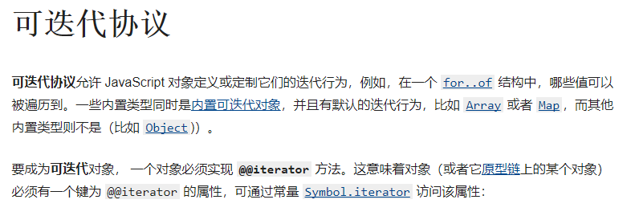

前端踩坑日记（一）

# 一.for in和for of

## （1）for in不建议搭配数组一起用，而要用for of

来对比下运行结果就知道了

1. 正常情况下：for

   ```
   var a = [];
   a[5] = 5;  
   
   for (var i = 0; i < a.length; i++) {
       // Iterate over numeric indexes from 0 to 5, as everyone expects.
       console.log(a[i]);
   }
   ```

   ```
   /* Will display:
      undefined
      undefined
      undefined
      undefined
      undefined
      5
   */
   ```

2. 相同情况下：for...in

   ```
   var a = [];
   a[5] = 5;
   for (var x in a) {
       // Shows only the explicitly set index of "5", and ignores 0-4
       console.log(x);
   }
   
   /* Will display:
      5
   */
   ```

   ​	这里可以看出，前面的几个value为null的索引是没有被枚举到的，官方的定义是**`for...in`语句**以任意顺序遍历一个对象的除[Symbol](https://developer.mozilla.org/en-US/docs/Web/JavaScript/Reference/Global_Objects/Symbol)以外的[可枚举](https://developer.mozilla.org/zh-CN/docs/Web/JavaScript/Enumerability_and_ownership_of_properties)属性，那什么是可枚举属性呢。可枚举属性是指那些内部 “可枚举” 标志设置为 `true` 的属性，对于通过直接的赋值和属性初始化的属性，该标识值默认为即为 `true`，对于通过 [Object.defineProperty](https://developer.mozilla.org/zh-CN/docs/Web/JavaScript/Reference/Global_Objects/Object/defineProperty) 等定义的属性，该标识值默认为 `false`。可枚举的属性可以通过 [for...in](https://developer.mozilla.org/zh-CN/docs/Web/JavaScript/Reference/Statements/for...in) 循环进行遍历（除非该属性名是一个 [Symbol](https://developer.mozilla.org/zh-CN/docs/Web/JavaScript/Reference/Global_Objects/Symbol)）。因此`for...in`不应该用于迭代一个关注索引顺序的 [`Array`](https://developer.mozilla.org/zh-CN/docs/Web/JavaScript/Reference/Global_Objects/Array)。

   ​	for...in其实还有一个问题是，它会把原型的属性一起读取进去

   ```
   Array.prototype.foo = 1;
   var a = [1, 2, 3, 4, 5];
   for (var x in a){
       console.log(x);
   }
   /* Will display:
      0
      1
      2
      3
      4
      foo
   */
   ```

   如果我要自身的属性而不要包含原型的属性呢？那我们就用`Object.prototype.hasOwnProperty()`来判断,

   ```
   for (var prop in obj) {
     if (obj.hasOwnProperty(prop)) {
       console.log(`obj.${prop} = ${obj[prop]}`);
     }
   }
   ```

   那你说for...in那么多问题，为什么要被发明出来呢，我们康康官方的解释

   ```
   for ... in是为遍历对象属性而构建的，不建议与数组一起使用，数组可以用Array.prototype.forEach()和for ... of，那么for ... in的到底有什么用呢？
   
   它最常用的地方应该是用于调试，可以更方便的去检查对象属性（通过输出到控制台或其他方式）。尽管对于处理存储数据，数组更实用些，但是你在处理有key-value数据（比如属性用作“键”），需要检查其中的任何键是否为某值的情况时，还是推荐用for ... in。
   ```

## （2）for..of不能用于Object

**`for...of`语句**在[可迭代对象](https://developer.mozilla.org/zh-CN/docs/Web/JavaScript/Reference/Iteration_protocols)（包括 [`Array`](https://developer.mozilla.org/zh-CN/docs/Web/JavaScript/Reference/Global_Objects/Array)，[`Map`](https://developer.mozilla.org/zh-CN/docs/Web/JavaScript/Reference/Global_Objects/Map)，[`Set`](https://developer.mozilla.org/zh-CN/docs/Web/JavaScript/Reference/Global_Objects/Set)，[`String`](https://developer.mozilla.org/zh-CN/docs/Web/JavaScript/Reference/Global_Objects/String)，[`TypedArray`](https://developer.mozilla.org/zh-CN/docs/Web/JavaScript/Reference/Global_Objects/TypedArray)，[arguments](https://developer.mozilla.org/en-US/docs/Web/JavaScript/Reference/Functions_and_function_scope/arguments) 对象等等）上创建一个迭代循环，调用自定义迭代钩子，并为每个不同属性的值执行语句，而Object并不是一个可迭代对象。

目前所有的内置可迭代对象如下：[`String`](https://developer.mozilla.org/zh-CN/docs/Web/JavaScript/Reference/Global_Objects/String)、[`Array`](https://developer.mozilla.org/zh-CN/docs/Web/JavaScript/Reference/Global_Objects/Array)、[`TypedArray`](https://developer.mozilla.org/zh-CN/docs/Web/JavaScript/Reference/Global_Objects/TypedArray)、[`Map`](https://developer.mozilla.org/zh-CN/docs/Web/JavaScript/Reference/Global_Objects/Map) 和 [`Set`](https://developer.mozilla.org/zh-CN/docs/Web/JavaScript/Reference/Global_Objects/Set)，它们的原型对象都实现了 `@@``iterator` 方法，

Object没有内置的`@@``iterator` 方法，所以不像类数组，没有数值索引也没有length属性

****

那object怎么获取长度呢？这个题目被面试管问过....emm

```
//方法一
function getLength (obj) {
    var i = 0;
    for (const index in this) {
        i ++ 
    }
    return i
}
```

```
//方法二
/*
*其实就是把对象转成数组再求长度
*/
Object.keys(obj).length
```

## 二.foreach，map

foreach和map应该是两个最容易搞混淆的，我们来康康定义先

> `map()` 方法创建一个新数组，其结果是该数组中的每个元素是调用一次提供的函数后的返回值。
>
> `forEach()` 方法对数组的每个元素执行一次给定的函数

1. 区别一:返回值不同

   ```
   const myAwesomeArray = [5, 4, 3, 2, 1]
   
   myAwesomeArray.map(x => x * x)
   // >>>>>>>>>>>>>>>>> Output: [25, 16, 9, 4, 1]
   myAwesomeArray.forEach(element => console.log(element.name))
   // >>>>>>>>>>>>>>>>> Output:5 4 3 2 1 undefined
   ```

   像map一样，foreach也要接受应该方法和参数，foreach的返回结果是undefined

2. 区别二:链式调用的能力
   如果使用map（），你可以链是调用reduce()`, `sort()`, `filter()...... 但foreach就不行，以为返回值为null

   ```
   const myAwesomeArray = [1, 2, 3, 4, 5]
   myAwesomeArray.forEach(x => x * x).reduce((total, value) => total + value)
   //>>>>>>>>>>>>> Uncaught TypeError: Cannot read property 'reduce' of undefined
   myAwesomeArray.map(x => x * x).reduce((total, value) => total + value)
   //>>>>>>>>>>>>>return value: 55
   ```

3. 区别三：变异性（mutability）
   mutate意思是说，change，alternate，modify....也就是被改变，这里的mutability就是说，运行API时候会不会改变传入对象

   ```
   forEach() does not mutate the array on which it is called. (However, callback may do so).
   
   map() does not mutate the array on which it is called (although callback, if invoked, may do so).
   ```

   所以，这是他们的共同点, immutability（不变性）

# 三.key相等的情况下给对象赋值

```
let temp = {
  "id": 18,
  "title": "title",
  "committer": 0,
  "commitTime": "2021-03-18T04:01:47Z",
  "lastUpdateTime": "",
  "deadline": "2006-01-04T07:04:05Z",
  "state": "0",
  "grade": "",
  "college": "",
}
let temp1 = {
  "id": 0,
  "title": "",
  "committer": 0,
  "commitTime": "",
  "lastUpdateTime": "",
  "deadline": "",
  "state": "0",
  "grade": "",
  "college": "",
  "sss": "okk",
  get college: ƒ reactiveGetter()
   ............
}
```

temp1是一个相对复杂的对象，temp 是我们想要填充的表单，那怎么把temp1的值填写到temp中去呢？

思路是遍历temp 的每一项，然后把temp1对应的值赋给temp，


