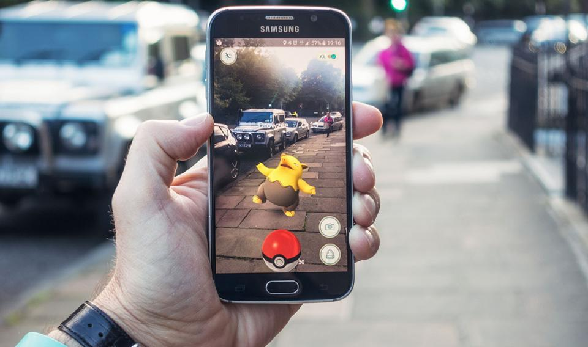

# WHAT’S THE DIFFERENCE BETWEEN AR, VR, AND MR?

AR通常通过使用智能手机上的相机来为实时视图添加数字元素。增强现实体验的例子包括Snapchat镜头和游戏《口袋妖怪Go》。

VR意味着一种完全沉浸的体验，将现实世界拒之门外。通过使用虚拟现实设备，如HTC Vive, Oculus Rift或谷歌Cardboard，用户可以被带到许多真实世界和想象的环境中，比如在一个呱呱叫的企鹅群中间，甚至是在龙的背上。

在结合了AR和VR元素的MR体验中，真实世界和数字物体相互作用。混合现实技术刚刚起步，微软的HoloLens是早期最著名的混合现实设备之一。

XR是一个包罗万象的术语，涵盖了所有增强我们感官的各种技术，无论是提供关于真实世界的额外信息，还是创造完全不真实的模拟世界供我们体验。它包括虚拟现实(VR)、增强现实(AR)和混合现实(MR)技术。

