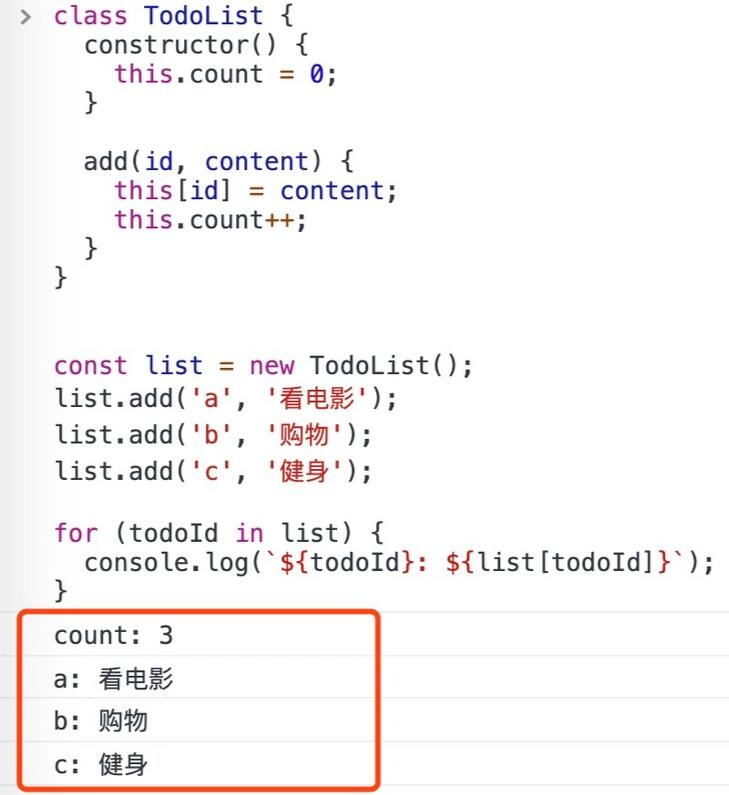

# 一.进程与线程的关系和区别

## 网络上的内容

> 内容是：从浏览器进程，再到浏览器内核运行，再到JS引擎单线程，再到JS事件循环机制，从头到尾系统的梳理一遍，摆脱碎片化，形成一个知识体系

- 区分进程和线程

  - 线程和进程区分不清，是很多新手都会犯的错误，没有关系。这很正常。先看看下面这个形象的比喻：

    ```
    - 进程是一个工厂，工厂有它的独立资源
    
    - 工厂之间相互独立
    
    - 线程是工厂中的工人，多个工人协作完成任务
    
    - 工厂内有一个或多个工人
    
    - 工人之间共享空间
    
    ----------完 善 概 念-----------------
    - 工厂的资源 -> 系统分配的内存（独立的一块内存）
    
    - 工厂之间的相互独立 -> 进程之间相互独立
    
    - 多个工人协作完成任务 -> 多个线程在进程中协作完成任务
    
    - 工厂内有一个或多个工人 -> 一个进程由一个或多个线程组成
    
    - 工人之间共享空间 -> 同一进程下的各个线程之间共享程序的内存空间（包括代码段、数据集、堆等）
    ```

    

  所以，应该更容易理解了：**进程是cpu资源分配的最小单位（系统会给它分配内存**）

  最后，再用较为官方的术语描述一遍：

  - 进程是cpu资源分配的最小单位（是能拥有资源和独立运行的最小单位）
  - 线程是cpu调度的最小单位（线程是建立在进程的基础上的一次程序运行单位，一个进程中可以有多个线程）

  tips

  - 不同进程之间也可以通信，不过代价较大
  - 现在，一般通用的叫法：**单线程与多线程**，都是指**在一个进程内**的单和多。（所以核心还是得属于一个进程才行）

- 浏览器是多进程的

  > 理解了进程与线程了区别后，接下来对浏览器进行一定程度上的认识：（先看下简化理解）
  >
  > - 浏览器是多进程的
  > - 浏览器之所以能够运行，是因为系统给它的进程分配了资源（cpu、内存）
  > - 简单点理解，每打开一个Tab页，就相当于创建了一个独立的浏览器进程。
  >
  > 关于以上几点的验证，**请再第一张图**：

  

  ### 浏览器都包含哪些进程？

  知道了浏览器是多进程后，再来看看它到底包含哪些进程：（为了简化理解，仅列举主要进程）

  1. Browser进程：浏览器的主进程（负责协调、主控），只有一个。作用有
     - 负责浏览器界面显示，与用户交互。如前进，后退等
     - 负责各个页面的管理，创建和销毁其他进程
     - 将Renderer进程得到的内存中的Bitmap，绘制到用户界面上
     - 网络资源的管理，下载等
  2. 第三方插件进程：每种类型的插件对应一个进程，仅当使用该插件时才创建
  3. GPU进程：最多一个，用于3D绘制等
  4. 浏览器渲染进程（浏览器内核）（Renderer进程，内部是多线程的）：默认每个Tab页面一个进程，互不影响。主要作用为
     - 页面渲染，脚本执行，事件处理等

  强化记忆：**在浏览器中打开一个网页相当于新起了一个进程（进程内有自己的多线程）**

  

  ### 重点是浏览器内核（渲染进程）

  重点来了，我们可以看到，上面提到了这么多的进程，那么，对于普通的前端操作来说，最终要的是什么呢？答案是**渲染进程**

  可以这样理解，页面的渲染，JS的执行，事件的循环，都在这个进程内进行。接下来重点分析这个进程

  **请牢记，浏览器的渲染进程是多线程的**（这点如果不理解，**请回头看进程和线程的区分**）

  

  #### WebWorker

  前文中有提到JS引擎是单线程的，而且JS执行时间过长会阻塞页面，那么JS就真的对cpu密集型计算无能为力么？

  所以，后来HTML5中支持了`Web Worker`。

  MDN的官方解释是：

  ```
  Web Worker为Web内容在后台线程中运行脚本提供了一种简单的方法。线程可以执行任务而不干扰用户界面
  
  一个worker是使用一个构造函数创建的一个对象(e.g. Worker()) 运行一个命名的JavaScript文件 
  
  这个文件包含将在工作线程中运行的代码; workers 运行在另一个全局上下文中,不同于当前的window
  
  因此，使用 window快捷方式获取当前全局的范围 (而不是self) 在一个 Worker 内将返回错误
  ```

  

  这样理解下：

  - 创建Worker时，JS引擎向浏览器申请开一个子线程（子线程是浏览器开的，完全受主线程控制，而且不能操作DOM）
  - JS引擎线程与worker线程间通过特定的方式通信（postMessage API，需要通过序列化对象来与线程交互特定的数据）

  所以，如果有非常耗时的工作，请单独开一个Worker线程，这样里面不管如何翻天覆地都不会影响JS引擎主线程，
  只待计算出结果后，将结果通信给主线程即可，perfect!

  而且注意下，**JS引擎是单线程的**，这一点的本质仍然未改变，Worker可以理解是浏览器给JS引擎开的外挂，专门用来解决那些大量计算问题。

  其它，关于Worker的详解就不是本文的范畴了，因此不再赘述。

## 面试题

1. 线程和进程的区别
   进程是**资源分配**的单元，线程是**CPU调度**的单元；

   线程的**划分尺度**小于进程，使得多线程程序的**并发性**高，实现在一个程序中，有多个执行部分可以同时执行；

2. 什么是任务队列
   主要是处理同步异步，不过任务队列除了放置异步任务的事件，"任务队列"还可以放置定时事件，即指定某些代码在多少时间之后执行。这叫做"定时器"（timer）功能，也就是定时执行的代码。

   > （1）所有同步任务都在主线程上执行，形成一个执行栈（execution context stack）。
   >
   > （2）主线程之外，还存在一个"任务队列"（task queue）。只要异步任务有了运行结果，就在"任务队列"之中放置一个事件。

   > （3）一旦"执行栈"中的所有同步任务执行完毕，系统就会读取"任务队列"，看看里面有哪些事件。那些对应的异步任务，于是结束等待状态，进入执行栈，开始执行。

   > （4）主线程不断重复上面的第三步。

3. ### Event Loop

   主线程从"任务队列"中读取事件，这个过程是循环不断的，所以整个的这种运行机制又称为Event Loop（事件循环）

# 二.TCP和UDP各自的特点和区别（三次握手四次挥手等）

> 1. tcp是面向连接的，udp是无连接就发送数据的。tcp的三次握手四次挥手相信大家都了然于心了。这就是tcp的面向连接，而udp就是一个数据报带着目的ip和端口就冲向了茫茫的网络大海一去不复返。**所以，tcp消耗的系统资源比较多。**
> 2. tcp传输是可靠的 udp传输不可靠 **udp相比之下容易丢包，报文乱序**
> 3. .基于tcp的应用层协议：http,https,ftp,telnet 基于udp ：dns,tftp

## 简单和他们说一下输入地址到返回请求


## tcp建立连接的过程

1. 创建链接

2. 数据传送

3. 终止链接

   > SYN_SENT 其中syn是指 同步序列号，独一无二的number
   >
   > ACK=x+1  acknowledge=ack
   >
   > FIN =finish


文字描述：

第一次握手，建立连接时候，客户端发送SYN=1，seq=x（x报文段序号）到服务器。客户端进入SYN-SENT状态，等待服务器响应。

第二次握手：服务器收到SYN=1包，必须确认客户的SYN，即回复ACK=1，SYN=1，同时发送自己报文段seq=y序号，和期待收到的报文段号为ack=x+1，此时服务器进入SYN_RECV状态。

第三次握手：客户端收到服务器得SYN和ACK状态，则再次发送ACK响应，同时发送自己得报文段序号seq=x+1，期待报文段ack=y+1。客户端和服务器端都进入**ESTABLISHED**状态，完成三次握手。

## 为什么连接的时候是三次握手，关闭的时候却是四次握手？

答：因为当Server端收到Client端的SYN连接请求报文后，可以直接发送SYN+ACK报文。其中ACK报文是用来应答的，SYN报文是用来同步的。但是关闭连接时，当Server端收到FIN报文时，很可能并不会立即关闭SOCKET，所以只能先回复一个ACK报文，告诉Client端，“你发的FIN报文我收到了”。只有等到我Server端所有的报文都发送完了，我才能发送FIN报文，因此不能一起发送。故需要四步握手。

# 三.symbol

是个基本数据类型，会返回symbol类型的值，每个从`Symbol()`返回的symbol值都是唯一的。一个symbol值能作为对象属性的标识符；这是该数据类型仅有的目的。

```
Symbol('1') === Symbol('1')//false
```

基本数据类型判断相等的参考是值，引用类型是根据那个地址，但symbol的一个key可以对应很多个value，所以理论上 Symbol 的存在只有一个意义：用于必须使用唯一值的场景

## 那如何使用symbol

1. 用作对象的key，防止命名冲突

使用Symbol作为Object的key，可以保证和其他key都不重复。因此，Symbol非常适合用于对对象的属性进行拓展。

比如，当使用 String 作为对象的key时，一旦出现重复的key则后面的属性会覆盖前面的：

```
const persons = {
 'bruce': 'wayne',
 'bruce': 'banner'
}

console.log(persons.bruce); // 'wayne'
使用Symbol作为Key可以避免这种情况：

const bruce1 = Symbol('bruce');
const bruce2 = Symbol('bruce');

const persons = {
 [bruce1]: 'wayne',
 [bruce2]: 'banner'
}

console.log(persons[bruce1]); // 'wayne'
console.log(persons[bruce2]); // 'banner'
```

**2. 使用Symbol定义枚举**

由于Javascript并不自带枚举类型，通常情况下我们会使用一个freezed的Object来模拟枚举类型，比如定义一个日期的枚举：

> const DAYS = Object.freeze({
> monday: 1,
> tuesday: 2,
> wednesday: 3
> });

此时有一个方法，接收 DAYS 的枚举值来返回当天要做的事：

```
function getTodo(day) {
 switch (day) {
  case DAYS.monday:
   return "看电影";
  case DAYS.tuesday:
   return "购物";
  case DAYS.wednesday:
   return "健身";
  default:
   return "日期错误";
 }
}
```

我们希望代码逻辑足够严谨，传入的参数严格按照 DAYS.monday 的形式，否则就返回日期错误，但是该枚举类型的实现却做不到。比如：getTodo(1) 依然能得到 “看电影” 这个结果。

但是使用Symbol却可以解决这一问题，DAYS 枚举类型可以重新定义为：

> const DAYS = Object.freeze({
> monday: Symbol('monday'),
> tuesday: Symbol('tuesday'),
> wednesday: Symbol('wednesday')
> });

此时 getTodo 方法必须接收 DAYS.monday 这样的枚举值作为参数，否则就返回 “日期错误”，因为世界上再没有任何一个值和 DAYS.monday 相等了。

这样定义枚举显然更严谨了。

**3. key为symbol类型的属性具有不能被枚举的**

​	Key为Symbol类型的属性是不能被枚举的，这是 Symbol 除了唯一性外的第二大特性，因此使用for...in，Object.keys()、Object.hasOwnProperty()等方法不能识别Symbol属性，简而言之Symbol属性对用户是“隐藏”的（但并不是private的，因为有其他途径可以获取Symbol属性），例如：


因此Symbol作为“隐藏”属性可以用来存储对象的元数据。比如，有一个 TodoList：

```
class TodoList {
 constructor() {
  // todo数量
  this.count = 0;
 }

 // 增加todo
 add(id, content) {
  this[id] = content;
  this.count++;
 }
}

const list = new TodoList();
```

我们使用 add() 方法向其中增加几个todo：

> list.add('a', '看电影');
> list.add('b', '购物');
> list.add('c', '健身');

当我们想使用 for...in 查看里面所有的todo时，会把 count 属性也带出来：



为了隐藏count属性，更方便的对todo进行操作，我们可以使用Symbol来存储它，TodoList 类修改为：

```
const count = Symbol('count');
class TodoList {
constructor() {
this[count] = 0;
}

add(id, content) {
this[id] = content;
this[count]++;
}
}
//这个时候就遍历不到
```

其实不用symbol也能解决这个问题其实，旺旺说vue2.0源码遇到此类业务场景，是用Object.defineProperty()去设置对象的不可遍历性

Object.defineProperty()方法会在一个对象上定义一个新属性，或者修改一个对象的现有属性，并返回此对象


```

class TodoList {
constructor() {
this[count] = 0;
}
Object.defineProperty(TodoList, "count",  {
  enumerable: false,
  configurable: false,
  writable: false,
})
add(id, content) {
this[id] = content;
this[count]++;
}
}
//这时候在for in时候就不会把 count方法遍历出来了
```


# 四.Map和Object

1：Object对象有原型， 也就是说他有默认的key值在对象上面， 除非我们使用Object.create(null)创建一个没有原型的对象；
2：在Object对象中， 只能把String和Symbol作为key值， 但是在Map中，key值可以是任何基本类型(String, Number, Boolean, undefined, NaN….)，或者对象(Map, Set, Object, Function , Symbol , null….);
3：通过Map中的size属性， 可以很方便地获取到Map长度， 要获取Object的长度， 你只能用别的方法了；

```
Object.keys（obj）.length
//获取object长度方法
```

4.Map实例对象的key值可以为一个数组或者一个对象，或者一个函数，比较随意 ，而且Map对象实例中数据的排序是根据用户push的顺序进行排序的， 而Object实例中key,value的顺序就是有些规律了， (他们会先排数字开头的key值，然后才是字符串开头的key值)；
关于 Array 和 Set, 区别就是 Set 不可以有重复元素, 而 Array 可以有

# 五.js的数据类型

JS数据类型：JS 的数据类型有几种？

     8种。Number、String、Boolean、Null、undefined、object、symbol、bigInt。

JS数据类型：Object 中包含了哪几种类型？

      其中包含了Data、function、Array等。这三种是常规用的。

JS数据类型：JS的基本类型和引用类型有哪些呢？

    基本类型（单类型）：除Object。 String、Number、boolean、null、undefined。
    
    引用类型：object。里面包含的 function、Array、Date。

JS数据类型：JS 中 typeof 输出分别是什么？

    { } 、[ ] 输出 object。
    
    console.log( ) 输出 function。
# 七.如何区分引用类型

> typeof判断值类型，instanceof判断引用类型

# 八.ES5 和 ES6的继承

### ES5继承

​	**原型链实现继承**

- 基本思想：利用原型让一个引用类型继承另一个引用类型的属性和方法，即让原型对象等于另一个类型的实例

- 基本模式：

  ```
  function SuperType(){
            this.property = true;
        }
        SuperType.prototype.getSuperValue = function(){
            return this.property;
        };
        function SubType(){
            this.subproperty = false;
        }
        \\继承了SuperType
        SubType.prototype = new SuperType();
  
        SubType.prototype.getSubValue = function(){
            return this.subproperty;
        };
        var instance = new SubType();
        alert(instance.getSuperValue());  \\true
  ```

- 借用构造函数
  基本思想：在子类型构造函数的内部调用超类型构造函数，通过使用apply和call方法在新建立的对象上执行函数

  ```
  function SuperType(){
      this.colors = ["red","blue","green"];
  }
  ​
  function SubType(){
      \\借调了超类型的构造函数
      SuperType.call(this);
  }
  ​
  var instance1 = new SubType();
  \\["red","blue","green","black"]
  instance1.colors.push("black");
  console.log(instance1.colors);
  ​
  var instance2 = new SubType();
  \\["red","blue","green"]
  console.log(instance2.colors);
  ```

- 寄生式组合继承 

  ```
  基本思想：不用严格意义上的构造函数，借助原型可以根据已有的对象创建新对象，还不必因此创建自定义类型，因此最初有如下函数：
  ```

  ```
  function Super(name){
  	this.name=name
  	this.colors = ["red","blue","green"];
  }
  SuperType.prototype.sayName=function(){
  	console.log(this.name)
  }
  function SubType(name,age){
  	Super.call(this,name)
  	this.age=age
  }
  SubType.prototype=new SuperType()
  SubType.prototype.constructor=SubType
  SubType.prototype.sayAge=function(){
  console.log(this.age)
  }
  ```


# 九.事件流

事件流是网页元素接收事件的顺序，"DOM2级事件"规定的事件流包括三个阶段：事件捕获阶段、处于目标阶段、事件冒泡阶段。首先发生的事件捕获，为截获事件提供机会。然后是实际的目标接受事件。最后一个阶段是时间冒泡阶段，可以在这个阶段对事件做出响应。虽然捕获阶段在规范中规定不允许响应事件，但是实际上还是会执行，所以有两次机会获取到目标对象。

```
<!DOCTYPE html>
<html lang="en">
<head>
    <meta charset="UTF-8">
    <title>事件冒泡</title>
</head>
<body>
    <div>
        <p id="parEle">我是父元素    <span id="sonEle">我是子元素</span></p>
    </div>
</body>
</html>
<script type="text/javascript">
var sonEle = document.getElementById('sonEle');
var parEle = document.getElementById('parEle');

parEle.addEventListener('click', function () {
    alert('父级 冒泡');
}, false);
parEle.addEventListener('click', function () {
    alert('父级 捕获');
}, true);

sonEle.addEventListener('click', function () {
    alert('子级冒泡');
}, false);
sonEle.addEventListener('click', function () {
    alert('子级捕获');
}, true);
</script>
```

当容器元素及嵌套元素，即在`捕获阶段`又在`冒泡阶段`调用事件处理程序时：**事件按DOM事件流的顺序**执行事件处理程序：

- 父级捕获
- 子级冒泡
- 子级捕获
- 父级冒泡

且当事件处于目标阶段时，事件调用顺序决定于绑定事件的**书写顺序**，按上面的例子为，先调用冒泡阶段的事件处理程序，再调用捕获阶段的事件处理程序。依次alert出“子集冒泡”，“子集捕获”。（编译顺序优先

# 十.事件是如何实现？

基于发布订阅模式，就是在浏览器加载的时候会读取事件相关的代码，但是只有实际等到具体的事件触发的时候才会执行。

比如点击按钮，这是个事件（Event），而负责处理事件的代码段通常被称为事件处理程序（Event Handler），也就是「启动对话框的显示」这个动作。

> DOM级别一共可以分为四个级别：DOM0级、DOM1级、DOM2级和DOM3级。而DOM事件分为3个级别：DOM 0级事件处理，DOM 2级事件处理和DOM 3级事件处理。由于DOM 1级中没有事件的相关内容，所以没有DOM 1级事件。
>
> DOM事件级别和发展历程有关系和优先级没关系

在 Web 端，我们常见的就是 DOM 事件：

- DOM0 级事件，直接在 html 元素上绑定 on-event，比如 onclick，取消的话，dom.onclick = null，同一个事件只能有一个处理程序，后面的会覆盖前面的。
- DOM2 级事件，通过 addEventListener 注册事件，通过 removeEventListener 来删除事件，一个事件可以有多个事件处理程序，按顺序执行，捕获事件和冒泡事件
- DOM3级事件，增加了事件类型，比如 UI 事件，焦点事件，鼠标事件

# 十一.实现一个函数：

```
function repeat (func, times, wait) { ... //补充代码}
//使下面调用代码能正常工作
const repeatFunc = repeat(console.log, 4, 3000)
repeatFunc("helloworld")//会输出四次helloworld，每次间隔3s
```

# 十二.New一个函数发生什么

构造调用：

1. 创造一个全新的对象
2. 这个对象会被执行 [[Prototype]] 连接，将这个新对象的 [[Prototype]] 链接到这个构造函数.prototype 所指向的对象
3. 这个新对象会绑定到函数调用的this
4. 如果函数没有返回其他对象，那么new表达式中的函数调用会自动返回这个新对象

# 十三.Proxy

## Proxy构造器

Proxy（）构造器用来创建Proxy对象

> new Proxy（target，handle）
>
> //传入参数 
>
> //target
>
> //`Proxy` 会对 target 对象进行包装。它可以是任何类型的对象，包括内置的数组，函数甚至是另一个代理对象。
>
> //handler 
>
> // 它是一个对象，它的属性提供了某些操作发生时所对应的处理函数。

## 

> 官方文档的劫持的意思就是 在对象函数被调用运行前 添加我们想要的功能   如果理解不了  可以结合vue的导航守卫理解（router.before.....）

结合前面symbol 的“使用场景”我们来看看  如何用proxy去设置一个属性的不可被遍历性（拗口，但翻译如此

```
//官方的使用介绍
var p=new Proxy(target,{
	defineProperty:function(target,property,descriptor)
	//target目标对象。
	//property待检索其描述的属性名。
	//descriptor待定义或修改的属性的描述符。
})
```

代理一个对象的意思就是当一个对象被更改时候，会动态触发函数，结合“订阅发布者模式”理解，vue 的数据响应就是这么实现的

```
var p = new Proxy({}, {
  defineProperty: function(target, prop, descriptor) {
    console.log('called: ' + prop);
    return true;
  }
});

var desc = { configurable: true, enumerable: true, value: 10 };
Object.defineProperty(p, 'a', desc); // "called: a"
```


