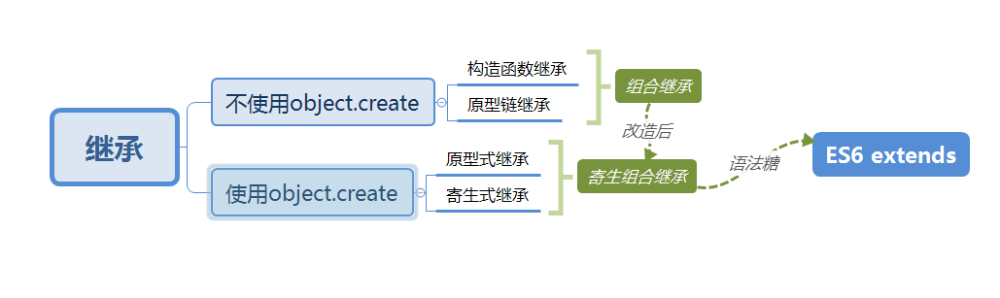

# JavaScript基础

## 数据基本类型

### 1.浅拷贝

- 浅拷贝是创建一个新对象，这个对象有着原始对象属性值的一份精确拷贝。如果属性是基本类型，拷贝的就是基本类型的值，如果属性是引用类型，拷贝的就是内存地址 ，所以**如果其中一个对象改变了这个地址，就会影响到另一个对象**。

  ### Object.assign()

  ```
  //Object.assign()是浅拷贝，拷贝的是对象的属性引用而不是对象本身
  //object只有一层的时候，是浅拷贝
  Object.assigin({},obj)
  ```

  ### Array.prototype.concat()

  ```
  let arr = [1, 3, {    username: 'kobe'    }];
  let arr2=arr.concat();    
  arr2[2].username = 'wade';
  console.log(arr);
  ```

  

  ### Array.prototype.slice()

  ```
  let arr = [1, 3, {    username: ' kobe'    }];
  let arr3 = arr.slice();
  arr3[2].username = 'wade'
  console.log(arr);
  ```


**关于Array的slice和concat方法的补充说明**：Array的slice和concat方法不修改原数组，只会返回一个浅复制了原数组中的元素的一个新数组。

### 2.深拷贝

深拷贝是将一个对象从内存中完整的拷贝一份出来,从堆内存中开辟一个新的区域存放新对象,且**修改新对象不会影响原对象**。

JSON.parse(JSON.stringify())

​	原理： 用JSON.stringify将对象转成JSON字符串，再用JSON.parse()把字符串解析成对象，一去一来，新的对象产生了，而且对象会开	辟新的栈，实现深拷贝。

​	**这种方法虽然可以实现数组或对象深拷贝，但不能处理函数。**

手写递归方法

​	 深度克隆原理：**遍历对象，数组直到里边都是基本数据类型，然后复制，就是深度拷贝**

```
//定义检测数据类型的功能函数 完美精准 的返回各种数据类型
function checkedType(target){
	return Object.prototype.toString.call(target)
}
//实现深度克隆 ---对象/数组
//----------------------
function deepclone1(obj) {
  var objclone = Array.isArray(obj) ? [] : {}
  if (obj && typeof obj === 'object') {
    for (key in obj) {
      if (obj.hasOwnProperty(key)) {
        //typeof 在array时候也会返回应该object
        if (obj[key] && typeof obj[key] === 'object') {
          objclone = deepclone1(obj[key])
        } else {
          objclone = obj[key]
        }
      }
    }
  }
  return objclone
}
//---实现克隆方法二

const deepclone = (o) => {
    if (Array.isArray(o)) {
        var arr = [];
        o.forEach(item => {
            arr.push(deepclone(item));
        });
        return arr;
    } else if (typeof o === "object") {
        var oo = {};
        for (var k in o) {
            oo[k] = deepclone(o[k]);
        }
        return oo;
    }
    return o;
}
console.log(deepclone(test));
```


## 作用域

### 	1.bind

​	

```
		函数.call(上下文对象，参数，参数，参数);
		函数.apply(上下文对象，[参数，参数，参数]);
```


### 	2.call和apply

```
var obj = {
	a: 10
}

function fun(b, c){
	console.log(this.a + b + c);
}

fun.call(obj, 3, 4);	
fun.apply(obj, [3, 4]);

fun = fun.bind(obj);		// 返回新的函数
fun(3,4);
```


## 闭包

闭包就是函数能够记忆住当初定义时候的作用域，不管函数到哪里执行了，永远都能够记住那个作用域，并且会遮蔽新作用域的变量。

```
function fun(){
	var a = 10;
	return function(){
		console.log(a);
	}
}
var a = 20;
var f = fun();
f();			// 10
```

### 作用① ：可预测状态容器。

```
function fun(){
	var a = 10;
	return {
		add(){
			a ++;
		},
		minus(){
			a--;
		},
		getA(){
			return a;
		}
	}
}
```

### 作用② 实现模块化，实现变量的私有封装。

### 作用③ 可以实现迭代器。

```
fun();		//1
fun();		//2
fun();		//3 
function ooo(){
	var a = 0;
	return fun(){
		a++;
		console.log(a);
	}
}
```

### 缺陷圆括号④：内存泄露

内存泄露：一个变量如果不用了，会被程序自动回收。内存泄露：垃圾回收不了这个东西了，就是内存泄露。

内存泄漏指由于疏忽或错误造成程序未能释放已经不再使用的内存。

我知道chrome浏览器中的performance面板。我曾经自己写着玩儿canvas坦克大战，用performance看性能，看FPS。（每秒传输帧数）

***\*意外的全局变量，所有不加var的变量，都是全局变量。\****

如果未声明的变量缓存大量的数据，会导致这些数据只有在窗口关闭或重新刷新页面时才能被释放。这样会造成意外的内存泄漏。

***\*console.log\****

***\*console.log上线的时候要删除，容易有内存泄露。\****

***\*闭包也能产生内存泄露。\****


### 引申： ***谈谈垃圾回收机制方式及内存管理***

和内存泄露一样，这个要看文章。

用完的变量会被自动回收。聊聊内存泄露。

//额外看其他文档学习一下

普及一下，学学名词。

## 原型

## 1.解释一下原型链

其基本思想就通过原型继承多个引用类型的属性和方法；原型，构造函数和实例的关系：每个构造函数都有一个原型对象，原型有一个属性指回构造函数，而实例有一个内部指针指向原型。

原型如果是另外一个类型的实例呢？那就意味着 这个原型本身有一个内部指针指向另外一个原型，相应滴 另外一个原型也有一个指针指向另外一个构造函数，这就在实例和原型之间构造了原型链

### 原型是啥？原型的功能

每一个对象都有原型，有原型链查找的功能：原型上定义的属性的方法；自己能打点调用

构造函数的prototype将成为它new出来的实例的原型

原型的功能就是把所有类的函数（方法）写到原型prototype上，这样节约内存，所有实例共用函数

建议直接给面试管画（涩）图

### 对原型链的理解

· 在js里，继承机制是原型继承。继承的起点是 对象的原型（Object prototype）。

· 一切皆为对象，只要是对象，就会有 proto 属性，该属性存储了指向其构造的指针。

· Object prototype也是对象，其 proto 指向null。

· 对象分为两种：函数对象和普通对象，只有函数对象拥有『原型』对象（prototype）。

· prototype的本质是普通对象。

· Function prototype比较特殊，是没有prototype的函数对象。

· new操作得到的对象是普通对象。

· 当调取一个对象的属性时，会先在本身查找，若无，就根据 proto 找到构造原型，若无，继续往上找。最后会到达顶层Object prototype，它的 proto 指向null，均无结果则返回undefined，结束。

· 由 proto 串起的路径就是『原型链』。

· 通过prototype可以给所有子类共享属性

· 函数（Function）才有prototype属性，对象（除Object）拥有***\*proto\**** 

· 实例的***\*proto\****等于构造函数的prototype

· 实例的constructor指向构造函数

### 可以用proto改原型

```
var obj = {
	m: 444
};
var o = {
};
o.__proto__ = obj;//{m:444}
```

### 构造器设置原型：

```
function A(){
}
A.prototype.mm=66
var aaa=new A()
```

### Object.create()

```
var ooo={
 m:444
}
var o=Object.create(ooo) // 以ooo为原型创建东西
console.log(o.__proto__ === ooo);			//true
```


## 2.js继承的六种方式

1. # 腾讯和字节一面整理

   ## 一.继承的六种方法以及优缺点

   > 这里继承部分参考 拉勾网 若离  
   >
   > 继承的方案设计要规避三个问题：避免因为共享引用类型的相互影响；避免两次调用父类构造函数造成浪费；避免不能继承继承原型属性或方法

   1. 原型链继承（共享引用类型，会相互影响）
      原型链继承是比较常见的继承方式之一，其中涉及的构造函数、原型和实例，三者之间存在着一定的关系，即每一个构造函数都有一个原型对象，原型对象又包含一个指向构造函数的指针，而实例则包含一个原型对象的指针。
      下面我们结合代码来了解一下。

      ```
        function Parent1() {
          this.name = 'parent1';
          this.play = [1, 2, 3]
        }
        function Child1() {
          this.type = 'child2';
        }
        Child1.prototype = new Parent1();
        console.log(new Child1());
      ```

      上面的代码看似没有问题，虽然父类的方法和属性都能够访问，但其实有一个潜在的问题，我再举个例子来说明这个问题。

      ```
        var s1 = new Child1();
        var s2 = new Child1();
        s1.play.push(4);
        console.log(s1.play, s2.play);
      ```

      这段代码在控制台执行之后，可以看到结果如下：

      明明我只改变了 s1 的 play 属性，为什么 s2 也跟着变了呢？原因很简单，因为两个实例使用的是同一个原型对象。它们的内存空间是共享的，当一个发生变化的时候，另外一个也随之进行了变化，这就是使用原型链继承方式的一个缺点。

   2. 构造函数继承（不能继承到原型属性或者方法）

      ```
      function Parent1(){
          this.name = 'parent1';
        }
      
        Parent1.prototype.getName = function () {
          return this.name;
        }
      
        function Child1(){
          Parent1.call(this);
          this.type = 'child1'
        }
      
        let child = new Child1();
        console.log(child);  // 没问题
        console.log(child.getName());  // 会报错
      ```

      

      因此，从上面的结果就可以看到构造函数实现继承的优缺点，它使父类的引用属性不会被共享，优化了第一种继承方式的弊端；但是随之而来的缺点也比较明显——只能继承父类的实例属性和方法，不能继承原型属性或者方法。

   3. 组合继承（两次调用构造造成浪费）
      这种方式结合了前两种继承方式的优缺点，结合起来的继承，代码如下。

      ```
        function Parent3 () {
          this.name = 'parent3';
          this.play = [1, 2, 3];
        }
      
        Parent3.prototype.getName = function () {
          return this.name;
        }
        function Child3() {
          // 第二次调用 Parent3()
          Parent3.call(this);
          this.type = 'child3';
        }
      
        // 第一次调用 Parent3()
        Child3.prototype = new Parent3();
        // 手动挂上构造器，指向自己的构造函数
        Child3.prototype.constructor = Child3;
        var s3 = new Child3();
        var s4 = new Child3();
        s3.play.push(4);
        console.log(s3.play, s4.play);  // 不互相影响
        console.log(s3.getName()); // 正常输出'parent3'
        console.log(s4.getName()); // 正常输出'parent3'
      ```

      但是这里又增加了一个新问题：通过注释我们可以看到 Parent3 执行了两次，第一次是改变Child3 的 prototype 的时候，第二次是通过 call 方法调用 Parent3 的时候，那么 Parent3 多构造一次就多进行了一次性能开销，这是我们不愿看到的。

      那么是否有更好的办法解决这个问题呢？请你再往下学习，下面的第六种继承方式可以更好地解决这里的问题。

      上面介绍的更多是围绕着构造函数的方式，那么对于 JavaScript 的普通对象，怎么实现继承呢？

   4. 原型式继承（引用类型有篡改可能）

      这里不得不提到的就是 ES5 里面的 Object.create 方法，这个方法接收两个参数：一是用作新对象原型的对象、二是为新对象定义额外属性的对象（可选参数）。

      我们通过一段代码，看看普通对象是怎么实现的继承。

      ```
       let parent4 = {
          name: "parent4",
          friends: ["p1", "p2", "p3"],
          getName: function() {
            return this.name;
          }
        };
      
        let person4 = Object.create(parent4);
        person4.name = "tom";
        person4.friends.push("jerry");
      
        let person5 = Object.create(parent4);
        person5.friends.push("lucy");
      
        console.log(person4.name);
        console.log(person4.name === person4.getName());
        console.log(person5.name);
        console.log(person4.friends);
        console.log(person5.friends);
      ```

      从上面的代码中可以看到，通过 Object.create 这个方法可以实现普通对象的继承，不仅仅能继承属性，同样也可以继承 getName 的方法，请看这段代码的执行结果。

      

      第一个结果“tom”，比较容易理解，person4 继承了 parent4 的 name 属性，但是在这个基础上又进行了自定义。

      第二个是继承过来的 getName 方法检查自己的 name 是否和属性里面的值一样，答案是 true。

      第三个结果“parent4”也比较容易理解，person5 继承了 parent4 的 name 属性，没有进行覆盖，因此输出父对象的属性。

      最后两个输出结果是一样的，讲到这里你应该可以联想到浅拷贝的知识点，关于引用数据类型“共享”的问题，其实 Object.create 方法是可以为一些对象实现浅拷贝的。

      **那么关于这种继承方式的缺点也很明显，多个实例的引用类型属性指向相同的内存，存在篡改的可能，接下来我们看一下在这个继承基础上进行优化之后的另一种继承方式——寄生式继承。**

      

   5. 寄生式继承（可以在原来的基础上，可以增加自己的东西）
      使用原型式继承可以获得一份目标对象的浅拷贝，然后利用这个浅拷贝的能力再进行增强，添加一些方法，这样的继承方式就叫作寄生式继承。

      虽然其优缺点和原型式继承一样，但是对于普通对象的继承方式来说，寄生式继承相比于原型式继承，还是在父类基础上添加了更多的方法。那么我们看一下代码是怎么实现。

      ```
       let parent5 = {
          name: "parent5",
          friends: ["p1", "p2", "p3"],
          getName: function() {
            return this.name;
          }
        };
      
        function clone(original) {
          let clone = Object.create(original);
          clone.getFriends = function() {
            return this.friends;
          };
          return clone;
        }
      
        let person5 = clone(parent5);
      
        console.log(person5.getName());
        console.log(person5.getFriends());
      ```

      通过上面这段代码，我们可以看到 person5 是通过寄生式继承生成的实例，它不仅仅有 getName 的方法，而且可以看到它最后也拥有了 getFriends 的方法
      

   6. 寄生组合继承

      结合第四种中提及的继承方式，解决普通对象的继承问题的 Object.create 方法，我们在前面这几种继承方式的优缺点基础上进行改造，得出了寄生组合式的继承方式，这也是所有继承方式里面相对最优的继承方式，代码如下。

      ```
       function clone (parent, child) {
          // 这里改用 Object.create 就可以减少组合继承中多进行一次构造的过程
          child.prototype = Object.create(parent.prototype);
          child.prototype.constructor = child;
        }
      
        function Parent6() {
          this.name = 'parent6';
          this.play = [1, 2, 3];
        }
         Parent6.prototype.getName = function () {
          return this.name;
        }
        function Child6() {
          Parent6.call(this);
          this.friends = 'child5';
        }
      
        clone(Parent6, Child6);
      
        Child6.prototype.getFriends = function () {
          return this.friends;
        }
      
        let person6 = new Child6();
        console.log(person6);
        console.log(person6.getName());
        console.log(person6.getFriends());
      ```

      通过这段代码可以看出来，这种寄生组合式继承方式，基本可以解决前几种继承方式的缺点，较好地实现了继承想要的结果，同时也减少了构造次数，减少了性能的开销，我们来看一下上面这一段代码的执行结果。

   7. ES6 的 extends 关键字实现逻辑

   我们可以利用 ES6 里的 extends 的语法糖，使用关键词很容易直接实现 JavaScript 的继承，但是如果想深入了解 extends 语法糖是怎么实现的，就得深入研究 extends 的底层逻辑。

   我们先看下用利用 extends 如何直接实现继承，代码如下

   ```
   class Person {
     constructor(name) {
       this.name = name
     }
     // 原型方法
     // 即 Person.prototype.getName = function() { }
     // 下面可以简写为 getName() {...}
     getName = function () {
       console.log('Person:', this.name)
     }
   }
   class Gamer extends Person {
     constructor(name, age) {
       // 子类中存在构造函数，则需要在使用“this”之前首先调用 super()。
       super(name)
       this.age = age
     }
   }
   const asuna = new Gamer('Asuna', 20)
   asuna.getName() // 成功访问到父类的方法
   ```

   那这个语法糖是怎么实现的呢，我们用babel试一下？以下是extends编译后的代码片段

   ```
   function _possibleConstructorReturn (self, call) { 
   		// ...
   		return call && (typeof call === 'object' || typeof call === 'function') ? call : self; 
   }
   function _inherits (subClass, superClass) { 
       // 这里可以看到
   	subClass.prototype = Object.create(superClass && superClass.prototype, { 
   		constructor: { 
   			value: subClass, 
   			enumerable: false, 
   			writable: true, 
   			configurable: true 
   		} 
   	}); 
   	if (superClass) Object.setPrototypeOf ? Object.setPrototypeOf(subClass, superClass) : subClass.__proto__ = superClass; 
   }
   
   var Parent = function Parent () {
   	// 验证是否是 Parent 构造出来的 this
   	_classCallCheck(this, Parent);
   };
   var Child = (function (_Parent) {
   	_inherits(Child, _Parent);
   	function Child () {
   		_classCallCheck(this, Child);
   		return _possibleConstructorReturn(this, (Child.__proto__ || Object.getPrototypeOf(Child)).apply(this, arguments));
   }
   	return Child;
   }(Parent));
   ```

   这个图片应该可以把问题说清楚

   

​         

## 3.class

## this指向

## ajax

## 事件

## dom操作

## 模块化

## 异步

Promise是ES6新增的处理异步的东西，叫做“承诺”。
Promise的实例有三种状态：pending（进行中）、resolved（成功）、rejected（失败）
Promise对象有then方法，用来做resolved的事情。
Promise对象有catch方法，用来做rejected的事情。

回答层次维度：
① 用途：回调黑洞的避免（最基本的使用）
传统异步函数，必须传入回调函数。

```

function addAfter2000ms(a, b, callback){
	setTimeout(function(){
		callback(a + b);
	}, 2000);
}

addAfter2000ms(3, 4, function(result){
	console.log(result);
});

//有了Promise之后，就这么封装一下：
function addAfter2000ms(a, b){
	return new Promise((resolve) => {
		setTimeout(function(){
			resolve(a + b);
		}, 2000);
	});
}

addAfter2000ms(3, 4).then(result => {
	console.log(result);
});
```

连续.then().then()没有回调黑洞了，变成了火车黑洞。

② 它的小伙伴async/await
小伙伴有async/await，它能够等异步执行完毕，再执行后面的语句。
它能够让我们以写同步的方法写异步：

```
function addAfter2000ms(a, b){
	return new Promise((resolve) => {
		setTimeout(function(){
			resolve(a + b);
		}, 2000);
	});
}

async function main(){
	const result = await addAfter2000ms(3,4).then(data => data);
	console.log(result);
}

main();
```

让我们用写同步的形式写异步函数。

让我们用写同步的形式写异步函数。

③ 它和Generator的结合。
Generator（加星函数、产生器），产生器是产生啥的：迭代器。

```
function addAfter2000ms(a, b){
	return new Promise((resolve) => {
		setTimeout(() => {
			resolve(a + b);
		}, 2000);
	});
}

function* gen(){
	yield addAfter2000ms(3, 4);
	yield 'B';
	yield 'C';
	yield 'D';
};

var i = gen();

i.next().value.then(result => {
	console.log(result);
	console.log(i.next());
	console.log(i.next());
	console.log(i.next());
	console.log(i.next());
	console.log(i.next());
	console.log(i.next());
});
```

加星函数可以调度Promise。例子：saga、dva

加星函数可以调度Promise。例子：saga、dva

```
effects:{
	*loadData(){
		const result = yield fetch();
		yield put();
		yield put();
		yield call();
	}
}
```

④ 关于方便处理异步的错误

```
//try{}catch(){}可以捕获异步的错误了。
async function main(){
	try{
		const result = await addAfter2000ms(3, 4).then(data => data.data);
		console.log(result);
	}catch(e){
		console.log("有错误");
		console.log(e);
	}
}

原来的异步，不能用try{  }catch(){  }：
try{
	setTimeout(function(){
		alert(m);
	}, 2000);
}catch(e){
	alert('补货到了错误');
}
```

then()里面有两个函数：
.then(fn1, fn2)
fn2就是处理错误的，它和.catch()的有啥区别？
fn2是我们能够预料到的某种服务器的错误，比如超时、服务器没有返回值等等；
.catch()是语法错误、可以throw的错误。

## ES6

### Set

拓展功能就是内置构造函数的prototype。里面的this就是调用这个函数的数组、字符串。

```
	Array.prototype.uniq = function(){
		return [...new Set(this)];
     };
```

数组去重的最简单的方法就是使用Set，这是ES6的新的数据类型，就是不能有重复项的数组。

### 数组方法

- #### reduce

  ```
  arr.reduce((a,b)=>a+b)
  //这里会执行一遍内部方法
  ```

- #### filter

  ```
   [1, 23, 34, 345, 234].filter(item => item % 2 == 0)
  Array.prototype.guolv = function(fn){
  	var arr = [];
  	for(let i = 0 ; i < this.length ; i++){
  		if(fn(this[i])) arr.push(this[i]);
  	}
  	return arr;
  }
  
  var arr = [23,34,3,5,23,123,32,453,4534,33,3444,55];
  
  console.log(arr.guolv(item => item % 2 == 0));
  ```


### 字符串

- trim
  去掉首尾空格

  ```
  ”我  哎  你 “.trim()
  ```

- 

### 结构赋值

```
[a,b]=[b,a]
//不借助第三方变量实现变量交换
```

# 网络安全

## 交互

## 浏览器渲染

 图片的base64编码可以将一副图片，都是要消耗一个http请求下载而来（所以才有雪碧图，但雪碧图也有弊端）

```
//在css里的写法``#fkbx-spch, #fkbx-hspch {`` ``background``: ``url``(data:image/gif;base``64``,R``0``lGODlhHAAmAKIHAKqqqsvLy``0``hISObm``5``vf``394``uLiwAAAP///yH``5``B…EoqQqJKAIBaQOVKHAXr``3``t``7``txgBjboSvB``8``EpLoFZywOAo``3``LFE``5``lYs/QW``9``LT``1``TRk``1``V``7``S``2``xYJADs=) ``no-repeat` `center``;``}
//在html代码img标签里的写法``<``img` `src``=``"data:image/gif;base64,R0lGODlhHAAmAKIHAKqqqsvLy0hISObm5vf394uLiwAAAP///yH5B…EoqQqJKAIBaQOVKHAXr3t7txgBjboSvB8EpLoFZywOAo3LFE5lYs/QW9LT1TRk1V7S2xYJADs="``>
```

  使用base64的应用场景就是足够小，**如果图片足够小且因为用处的特殊性无法被制作成雪碧图（CssSprites），在整个网站的复用性很高且基本不会被更新**。

优点：

无额外请求

对于极小或者极简单图片

可像单独图片一样使用，比如背景图片重复使用等

没有跨域问题，无需考虑缓存、文件头或者cookies问题  

```
那么此时使用 base64 编码传输图片就可谓好钢用在刀刃上，思前想后，符合这个规则的，有一个是我们经常会遇到的，就是页面的背景图 background-image 。在很多地方，我们会制作一个很小的图片大概是几px*几px，然后平铺它页面当背景图。因为是背景图的缘故，所以无法将它放入雪碧图，而它却存在网站的很多页面，这种图片往往只有几十字节，却需要一个 http 请求，十分不值得。那么此时将它转化为 base64 编码，何乐而不为？
```

 使用 Base64 不代表性能优化

是的，使用 Base64 的好处是能够减少一个图片的 HTTP 请求，然而，与之同时付出的代价则是 CSS 文件体积的增大。

而 CSS 文件体积的增大意味着什么呢？

- 意味着 CRP 的阻塞。

> CRP（Critical Rendering Path，关键渲染路径）：当浏览器从服务器接收到一个HTML页面的请求时，到屏幕上渲染出来要经过很多个步骤。浏览器完成这一系列的运行，或者说渲染出来我们常常称之为“**关键渲染路径**”。

​	通俗而言，就是图片不会导致关键渲染路径的阻塞，而转化为 Base64 的图片大大增加了 CSS 文件的体积，CSS 文件的体积直接影	响渲染，导致用户会长时间注视空白屏幕。HTML 和 CSS 会阻塞渲染，而图片不会。

-  页面解析 CSS 生成的 CSSOM 时间增加

### 跨域

- cors跨域 后端的

- 代理跨域，设置好webpack-dev-server

- jsonp

  是接口不是JSON，是函数的调用：

   ***\*fun(\****{total:100, results:[]}***\*)\****;

  页面用script的src引入它，***\*srcipt没有跨域限制的漏洞\****，然后页面内定义function fun()，就通过形参、实参的集合进入页面了。

### 请求

GET请求和POST请求都是HTTP的请求类型。GET请求在URL中用？k=v&k=v形式带参数；POST请求在HTTP请求***\*报文体中\****带参数。

GET请求通常用来用户查询信息，比如/order?id=1001 ， 优点是方便分享网址，但是是明文的，所以不能用于机密信息提交。

POST请求通常用于表单提交，甚至可以传输文件，没有传输限制、安全。

### HTTP状态码

2开头：成功

3开头：重定向

4开头：请求错误

5开头：服务器错误

### HTTP请求过程

TCP三次握手->建立连接后发送http请求-->服务器响应http请求，浏览器得到html--->浏览器html解析，并请求html代码中的资源--->浏览器对页面渲染呈现出来

```
HTTP通信机制是在一次完整的HTTP通信过程中，Web浏览器与Web服务器之间将完成下列7个步骤： 

1. 建立TCP连接

在HTTP工作开始之前，Web浏览器首先要通过网络与Web服务器建立连接，该连接是通过TCP来完成的，该协议与IP协议共同构建Internet，即著名的TCP/IP协议族，因此Internet又被称作是TCP/IP网络。HTTP是比TCP更高层次的应用层协议，根据规则，只有低层协议建立之后才能，才能进行更层协议的连接，因此，首先要建立TCP连接，一般TCP连接的端口号是80。

2. Web浏览器向Web服务器发送请求命令 

一旦建立了TCP连接，Web浏览器就会向Web服务器发送请求命令。例如：GET/sample/hello.jsp HTTP/1.1。

3. Web浏览器发送请求头信息 

浏览器发送其请求命令之后，还要以头信息的形式向Web服务器发送一些别的信息，之后浏览器发送了一空白行来通知服务器，它已经结束了该头信息的发送。 

4. Web服务器应答 

客户机向服务器发出请求后，服务器会客户机回送应答， HTTP/1.1 200 OK ，应答的第一部分是协议的版本号和应答状态码。

5. Web服务器发送应答头信息 

正如客户端会随同请求发送关于自身的信息一样，服务器也会随同应答向用户发送关于它自己的数据及被请求的文档。 

6. Web服务器向浏览器发送数据 

Web服务器向浏览器发送头信息后，它会发送一个空白行来表示头信息的发送到此为结束，接着，它就以Content-Type应答头信息所描述的格式发送用户所请求的实际数据。

7. Web服务器关闭TCP连接 

一般情况下，一旦Web服务器向浏览器发送了请求数据，它就要关闭TCP连接，然后如果浏览器或者服务器在其头信息加入了这行代码：

Connection:keep-alive 

TCP连接在发送后将仍然保持打开状态，于是，浏览器可以继续通过相同的连接发送请求。保持连接节省了为每个请求建立新连接所需的时间，还节约了网络带宽。
```

## 构建

## 框架

## 设计模式


# 性能优化

## 例题

1. 懒加载：不显示不加载；vue插件

   - Js事件监听：
     思路：用标签，懒加载时候我们js检查是否在视窗里面（监听scroll或者resize）

   - 利用intersection observer

     思路：创建一个observer对象，传入相应的参数和回调函数，回调函数会在目标（target）元素和根（root）元素的交集大小超出阈值执行

     ```
     let options={
     	root：document.querySelector('#scrollArea'),
     	rootMargin:'0rpx',
     	threshold:1.0
     }
     ```

2. 图片用精灵图

3. 图片用base64编码 图片的base64编码可以将一副图片，都是要消耗一个http请求下载而来（所以才有雪碧图，但雪碧图也有弊端）

   ```
   //在css里的写法``#fkbx-spch, #fkbx-hspch {`` ``background``: ``url``(data:image/gif;base``64``,R``0``lGODlhHAAmAKIHAKqqqsvLy``0``hISObm``5``vf``394``uLiwAAAP///yH``5``B…EoqQqJKAIBaQOVKHAXr``3``t``7``txgBjboSvB``8``EpLoFZywOAo``3``LFE``5``lYs/QW``9``LT``1``TRk``1``V``7``S``2``xYJADs=) ``no-repeat` `center``;``}
   //在html代码img标签里的写法``<``img` `src``=``"data:image/gif;base64,R0lGODlhHAAmAKIHAKqqqsvLy0hISObm5vf394uLiwAAAP///yH5B…EoqQqJKAIBaQOVKHAXr3t7txgBjboSvB8EpLoFZywOAo3LFE5lYs/QW9LT1TRk1V7S2xYJADs="``>
   ```

     使用base64的应用场景就是足够小，**如果图片足够小且因为用处的特殊性无法被制作成雪碧图（CssSprites），在整个网站的复用性很高且基本不会被更新**。

   优点：

   无额外请求

   对于极小或者极简单图片

   可像单独图片一样使用，比如背景图片重复使用等

   没有跨域问题，无需考虑缓存、文件头或者cookies问题  

   ```
   那么此时使用 base64 编码传输图片就可谓好钢用在刀刃上，思前想后，符合这个规则的，有一个是我们经常会遇到的，就是页面的背景图 background-image 。在很多地方，我们会制作一个很小的图片大概是几px*几px，然后平铺它页面当背景图。因为是背景图的缘故，所以无法将它放入雪碧图，而它却存在网站的很多页面，这种图片往往只有几十字节，却需要一个 http 请求，十分不值得。那么此时将它转化为 base64 编码，何乐而不为？
   ```

    使用 Base64 不代表性能优化

   是的，使用 Base64 的好处是能够减少一个图片的 HTTP 请求，然而，与之同时付出的代价则是 CSS 文件体积的增大。

   而 CSS 文件体积的增大意味着什么呢？

   - 意味着 CRP 的阻塞。

   > CRP（Critical Rendering Path，关键渲染路径）：当浏览器从服务器接收到一个HTML页面的请求时，到屏幕上渲染出来要经过很多个步骤。浏览器完成这一系列的运行，或者说渲染出来我们常常称之为“**关键渲染路径**”。

   ​	通俗而言，就是图片不会导致关键渲染路径的阻塞，而转化为 Base64 的图片大大增加了 CSS 文件的体积，CSS 文件的体积直接影	响渲染，导致用户会长时间注视空白屏幕。HTML 和 CSS 会阻塞渲染，而图片不会。

   -  页面解析 CSS 生成的 CSSOM 时间增加

## 方向

- 请求次数
- 内容体积
- 体积压缩

## 代码

## 图片

## 网络


# HTML&CSS

## 选择器

## DOM

### 例题

1. 页面上十个li添加监听，点谁谁变红

   - 批量添加监听

   ```
   var lis = document.getElementsByTagName('li');
   for(let i = 0 ; i < lis .length; i++){			
   	lis[i].onclick = function(){
   		alert(i);
   		this.style.background = "red'
   	}
   }
   ```

   - 事件委托
     	委托给父亲，利用事件冒泡

     ```
     ul.onclick= function(e){
     		e.target.style.background = "red"
     }
     ```

     ‘事件委托’两个情况使用：大量元素添加，动态上树

   - 

2. 

## 盒子模型

- 盒模型包括的属性

  - box-sizing

    - content-box

      content-box是默认值。如果你设置一个元素的宽为100px，那么这个元素的内容区会有100px 宽，并且任何边框和内边距的宽度都会被增加到最后绘制出来的元素宽度中。

    - border-box
      `border-box` 告诉浏览器：你想要设置的边框和内边距的值是包含在width内的。也就是说，如果你将一个元素的width设为100px，那么这100px会包含它的border和padding，内容区的实际宽度是width减去(border + padding)的值。大多数情况下，这使得我们更容易地设定一个元素的宽高

    **译者注:** `border-box`不包含`margin`

- box-sizing

## 重排重绘

## BFC

## 布局技术

## 响应式

## 动画

## flex

### FlexBox

```
<div class="flex-container">
	<div>1</div>
  	<div>2</div>
  	<div>3</div>  
</div>
--------------
.flex-container {
  display: flex;
}
.flex-container > div {
}
```

### Flex container


- align-content
  和align-items很相似，但他不是作用于items，而是作用于flex-lines

- align-items

  是垂直轴对齐做参考的，他们说是交叉轴

- justify-content

  是横轴对其做参考的，针对box

### Flex Items


### Flex Responsive

- flex-direction
- flex-wrap：裹着后，会确保大小，超出就换行

### 预处理器

## SEO

## CSS兼容

## 面试题

### 1.垂直水平居中

```
justify-content：center;
aligin-items:center;
```

### 2.双栏布局

描述：描述（左边固定，右边自适应）

```
      /*方法四:flex*/
        .content{
            display: flex;
            display: -webkit-flex;
        }
        .left {
            height: 200px;
            background-color: red;
            flex: 0 1 200px;
        }

        .right {
            height: 200px;
            background-color: yellow;
            flex: 1 1 auto;
        }
```

### 3.随窗口变化正方形


### 4.三栏布局中间部分


# 简单算法

# 浏览器原理

## 面试官老在问的浏览器渲染进程

## 0.浏览器及其渲染引擎

> 最近准备面试时候经常看到浏览器相关的面试题，这篇文章重点记录的是渲染进程

### （1）.浏览器的大致组成


### （2）.各自的渲染引擎


## 1.渲染进程

- GUI渲染进程

  1. 当浏览器收到响应的html后，该线程开始解析HTML文档构建DOM树，解析CSS文件构建CSSOM，合并构成渲染树，并计算布局样式，绘制在页面上(该处可深挖的坑，HTML解析规则，CSS解析规则，渲染流程细节)
  2. 当界面样式被修改的时候可能会触发reflow和repaint，该线程就会重新计算，重新绘制，是前端开发需要着重优化的点

- JS引擎进程

  > JS内核，也称JS引擎（例如V8引擎），负责处理执行javascript脚本程序
  >
  > 由于JS是单线程（一个Tab页内中无论什么时候都只有一个JS线程在运行JS程序），依靠任务队列来进行js代码的执行，所以js引擎会一直等待着任务队列中任务的到来，然后加以处理。

  - 事件触发线程

    ​	归属于渲染（浏览器内核）进程，不受js引擎线程控制。主要用于控制事件（例如鼠标，键盘等事件），当该事件触发时候，事件触发线程就会把该事件的处理函数添加任务队列中，等待JS引擎空闲后执行

  - 定时器触发线程

    1. 传说中的setInterval和setTimeout所在线程
    2. 浏览器览器的定时器并不是由JavaScript引擎计数的，因为JavaScript引擎是单线程的, 如果处于阻塞线程状态就会影响计时的准确，因此通过单独的线程来计时并触发定时器，计时完毕后，满足定时器的触发条件，则将定时器的处理函数添加进任务队列中，等待JS引擎线程空闲后执行。

  - 异步http请求线程

    ​	当XMLHttpRequest连接后，浏览器会新开一个进程，当监控到readyState状态变更时候，如果设置了该状态的回调，则将该状态的处理函数推进任务队列中，等待JS引擎线程空闲后执行


## 2.GUI渲染线程与JS引擎线程互斥

​	由于JavaScript是可操纵DOM的，如果在修改这些元素属性同时渲染界面（即JS线程和UI线程同时运行），那么渲染线程前后获得的元素数据就可能不一致了。

​	因此为了防止渲染出现不可预期的结果，浏览器设置GUI渲染线程与JS引擎为互斥的关系。

​	不过JS引擎执行时GUI线程也不会完全被挂起，而是GUI线程无法响应队列的变化，GUI更新则会被保存在一个队列中等到JS引擎线程空闲时立即被执行，在此过程中依然是可以继续响应一些例如链接点击、CSS动画之类的事情的

​	因此JS阻塞页面加载，假设JS引擎正在进行巨量的计算，此时就算GUI有更新，也会被保存到队列中，等待JS引擎空闲后执行。然后，由于巨量计算，所以JS引擎很可能很久很久后才能空闲，自然会感觉到巨卡无比。

​	所以，要尽量避免JS执行时间过长，这样就会造成页面的渲染不连贯，导致页面渲染加载阻塞的感觉。

## 3.密集计算造成的JS阻塞的应对方案

​	因为JS引擎是单线程的，当JS执行时间过长会页面阻塞，所以在HTML5提出Web Workers API

​	通过使用Web Workers，Web应用程序可以在独立于主线程的后台线程中，运行一个脚本操作。这样做的好处是可以在独立线程中执行费时的处理任务，从而允许主线程（通常是UI线程）不会因此被阻塞/放慢。

​	如果需要进行一些高耗时的计算时，可以单独开启一个WebWorker线程，这样不管这个WebWorker子线程怎么密集计算、怎么阻塞，都不会影响JS引擎主线程，只需要等计算结束，将结果通过postMessage传输给主线程就可以了。

## 4.那CSS加载是否会阻塞DOM树渲染

------

css加载不会阻塞DOM树解析（css是由单独的下载线程异步下载的。异步加载时DOM照常构建）

但会阻塞render树渲染（渲染时需等css加载完毕，因为render树需要css信息）

**为什么会阻塞render树的渲染？**

​		这里就是一个很简单的拓扑依赖关系，渲染当然需要样式，css没有加载完哪里来的样式让你渲染，也不可能加载一半拿一半的css去渲染呀，一个是没必要，一个是css有继承、覆盖等关系，完全加载完之前谁也不知道最后的样式会是什么样

​		这可能也是浏览器的一种优化机制。因为你加载css的时候，可能会修改下面DOM节点的样式，如果css加载不阻塞render树渲染的话，那么当css加载完之后，render树可能又得重新重绘或者回流了，这就造成了一些没有必要的损耗。

​		所以干脆就先把DOM树的结构先解析完，把可以做的工作做完，然后等你css加载完之后，在根据最终的样式来渲染render树，这种做法性能方面确实会比较好一点。

## 5.浏览器的渲染流程

了解完前面的逻辑之后，我们可以来尝试去看看浏览器的渲染流程

一个HTML文本解析成页面的过程其实是很曲折的


### （1）.HTML解析成DOM树

HTML文本是怎么变成DOM对象的呢

 

在了解HTML是怎么解释成dom树之前，我们先举个栗子：

如果我们要进行一个运算，比如2+3-4

那就会变成这样


那解析的过程发生了什么


相同的道理，三剑客解析流程也是这样的


### （2）.静态页面渲染流程概述

> 知道了三剑客的大致渲染流程后，那静态页面细节是怎么样的呢


边加载边解析边渲染的，DOM tree和Render Tree在过程中是动态变化的

### （3）.重排和重绘

下图是重排重绘在流程中的步骤位置


以下是重排重绘的相关含义 and 触发条件


一般来说，有重排就会有重绘，但重绘不一定有重排

重排会相对更耗性能

以下是重绘和重绘性能对比（打开perfermance面板)

1. 重排

   - 改变过程

   

   - 相关数据

   

2. 重绘

   - 改变过程
     

   - 相关数据

     这里可以观察到，这时候是没有layout的过程

     

   总结：我们要避免多次触发重排，比较费性能

### （4）.复现完整流程

HTML过程中边加载边解析边渲染


> 本文章部分内容参考自朱光勇的博客以及腾讯IMWeb团队的视频内容，以及恶猫蔡璧提出的修改建议